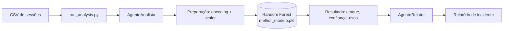
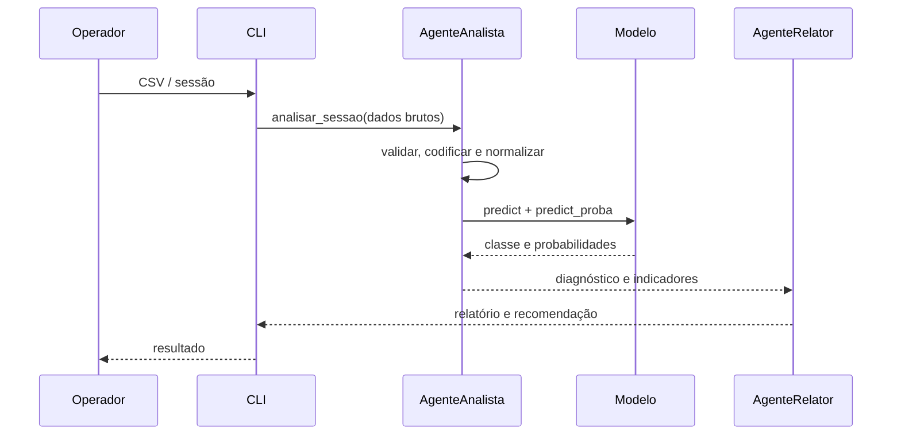
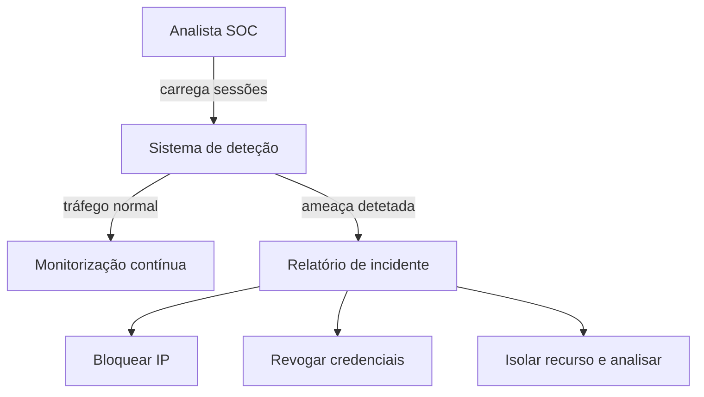

# Diagramas do sistema multiagente

Os diagramas Mermaid abaixo podem ser visualizados diretamente no GitHub.

## 1. Arquitetura de deployment

## 2. Sequência de análise de uma sessão

## 3. Caso de uso SOC

