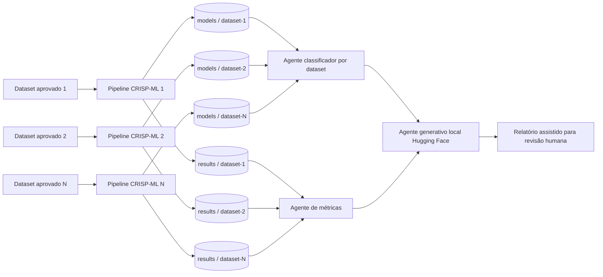
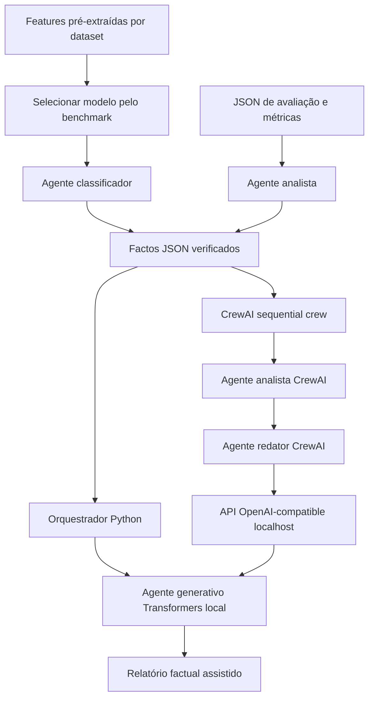
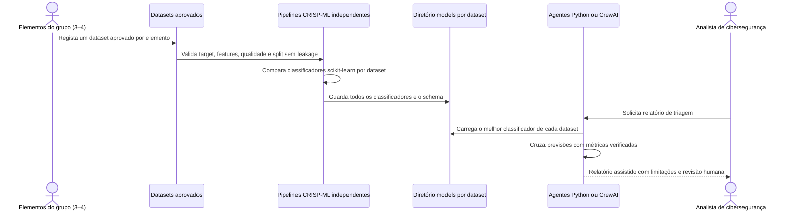

# Arquitetura multiagente e caso de uso

Os diagramas mostram a arquitetura pretendida por dataset aprovado. Nesta
branch só está configurado `ransom.csv`; os datasets dos restantes elementos
devem ser adicionados depois de recebidos e validados.

## Pipeline CRISP-ML por dataset e armazenamento

## Multiagente local e alternativa CrewAI

## Caso de uso para os datasets do grupo

